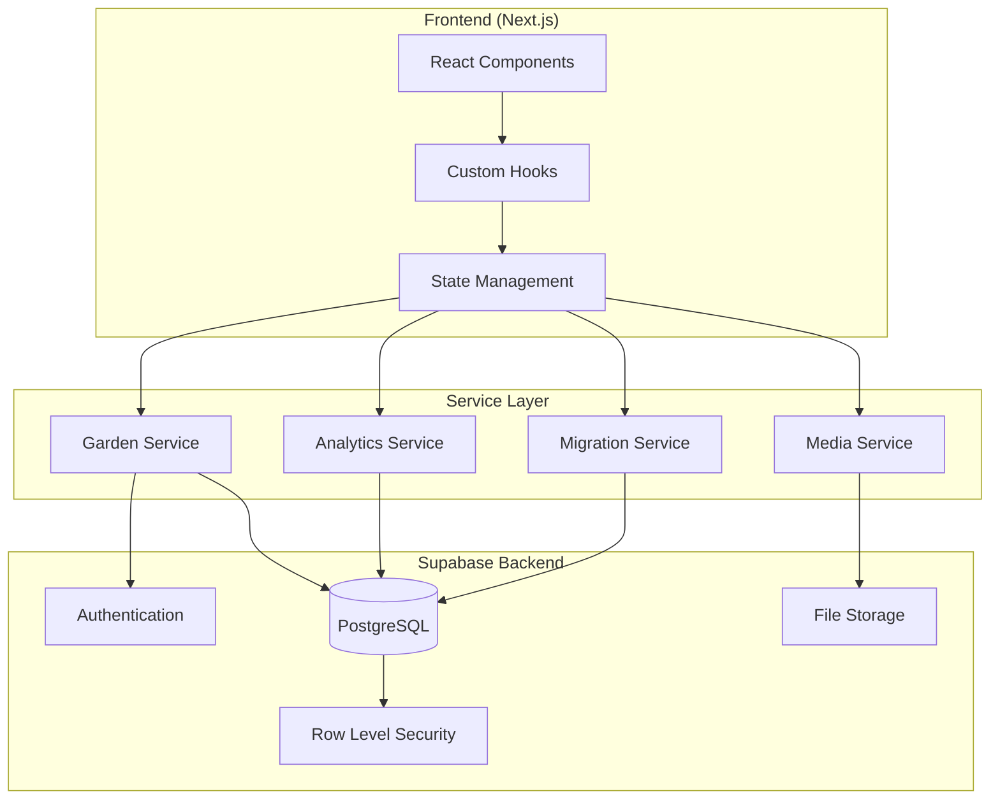
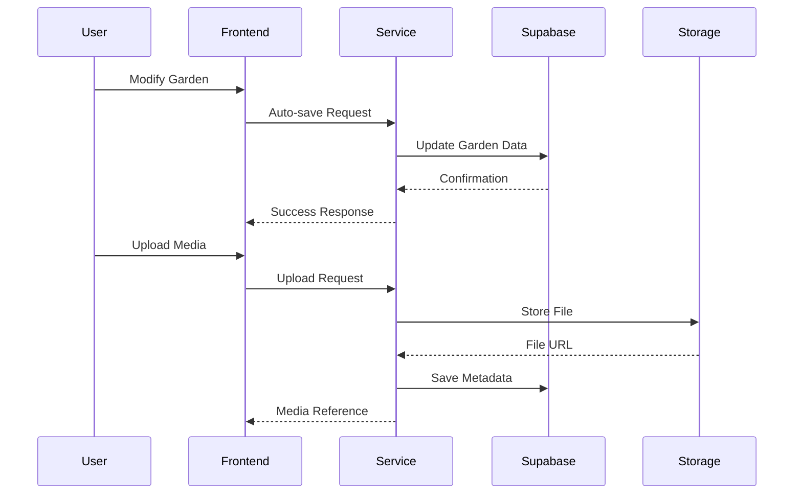
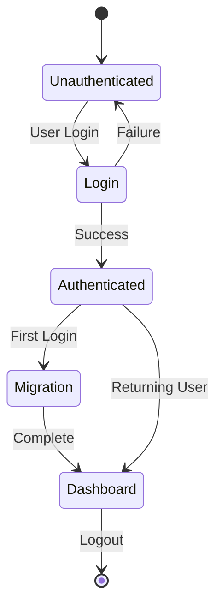

# Design Document: Digital Garden Backend Integration

## Overview

This design transforms the existing frontend-only Digital Garden application into a full-stack solution using Supabase as the backend infrastructure. The architecture maintains the existing React/Next.js frontend while adding PostgreSQL database persistence, user authentication, file storage, and public sharing capabilities.

The design follows a service-oriented architecture with clear separation between data access, business logic, and presentation layers. All existing UI components and user workflows remain unchanged, ensuring a seamless transition for current users.

## Architecture

### System Architecture



### Data Flow Architecture



### Authentication Flow



## Components and Interfaces

### Database Schema

#### Users Table
```sql
CREATE TABLE users (
    id UUID PRIMARY KEY DEFAULT gen_random_uuid(),
    email TEXT UNIQUE NOT NULL,
    display_name TEXT,
    avatar_url TEXT,
    onboarding_completed BOOLEAN DEFAULT FALSE,
    preferences JSONB DEFAULT '{}',
    created_at TIMESTAMP WITH TIME ZONE DEFAULT NOW(),
    updated_at TIMESTAMP WITH TIME ZONE DEFAULT NOW()
);
```

#### Gardens Table
```sql
CREATE TABLE gardens (
    id UUID PRIMARY KEY DEFAULT gen_random_uuid(),
    user_id UUID REFERENCES users(id) ON DELETE CASCADE,
    title TEXT NOT NULL DEFAULT 'Untitled Garden',
    description TEXT,
    tiles JSONB NOT NULL DEFAULT '[]',
    layout JSONB NOT NULL DEFAULT '{}',
    is_public BOOLEAN DEFAULT FALSE,
    slug TEXT UNIQUE,
    view_count INTEGER DEFAULT 0,
    created_at TIMESTAMP WITH TIME ZONE DEFAULT NOW(),
    updated_at TIMESTAMP WITH TIME ZONE DEFAULT NOW()
);
```

#### Media Assets Table
```sql
CREATE TABLE media_assets (
    id UUID PRIMARY KEY DEFAULT gen_random_uuid(),
    user_id UUID REFERENCES users(id) ON DELETE CASCADE,
    garden_id UUID REFERENCES gardens(id) ON DELETE CASCADE,
    file_name TEXT NOT NULL,
    file_type TEXT NOT NULL,
    file_size INTEGER NOT NULL,
    storage_path TEXT NOT NULL,
    thumbnail_path TEXT,
    alt_text TEXT,
    created_at TIMESTAMP WITH TIME ZONE DEFAULT NOW()
);
```

#### Garden Views Table
```sql
CREATE TABLE garden_views (
    id UUID PRIMARY KEY DEFAULT gen_random_uuid(),
    garden_id UUID REFERENCES gardens(id) ON DELETE CASCADE,
    viewer_ip TEXT,
    viewer_country TEXT,
    referrer TEXT,
    viewed_at TIMESTAMP WITH TIME ZONE DEFAULT NOW()
);
```

### Service Layer Interfaces

#### Garden Service Interface
```typescript
interface GardenService {
  // CRUD Operations
  createGarden(userId: string, gardenData: CreateGardenRequest): Promise<Garden>
  getGarden(gardenId: string, userId?: string): Promise<Garden>
  updateGarden(gardenId: string, updates: UpdateGardenRequest): Promise<Garden>
  deleteGarden(gardenId: string, userId: string): Promise<void>
  
  // User Gardens
  getUserGardens(userId: string): Promise<Garden[]>
  
  // Public Gardens
  getPublicGarden(slug: string): Promise<PublicGarden>
  publishGarden(gardenId: string, slug: string): Promise<void>
  unpublishGarden(gardenId: string): Promise<void>
  
  // Auto-save
  autoSaveGarden(gardenId: string, tiles: Tile[], layout: Layout): Promise<void>
}
```

#### Media Service Interface
```typescript
interface MediaService {
  // File Upload
  uploadFile(file: File, userId: string, gardenId: string): Promise<MediaAsset>
  
  // File Management
  getMediaAssets(userId: string, gardenId?: string): Promise<MediaAsset[]>
  deleteMediaAsset(assetId: string, userId: string): Promise<void>
  
  // URL Generation
  getSignedUrl(storagePath: string): Promise<string>
  getThumbnailUrl(assetId: string): Promise<string>
  
  // Validation
  validateFileType(file: File): boolean
  validateFileSize(file: File): boolean
}
```

#### Migration Service Interface
```typescript
interface MigrationService {
  // Detection
  hasLocalStorageData(): boolean
  
  // Migration
  migrateUserData(userId: string): Promise<MigrationResult>
  
  // Validation
  validateMigrationData(data: LocalStorageData): boolean
  
  // Cleanup
  clearLocalStorageData(): void
}
```

### React Hooks Integration

#### useGarden Hook
```typescript
function useGarden(gardenId?: string) {
  const [garden, setGarden] = useState<Garden | null>(null)
  const [loading, setLoading] = useState(false)
  const [error, setError] = useState<string | null>(null)
  
  const saveGarden = useCallback(async (tiles: Tile[], layout: Layout) => {
    // Auto-save implementation with debouncing
  }, [gardenId])
  
  const publishGarden = useCallback(async (slug: string) => {
    // Publish garden implementation
  }, [gardenId])
  
  return { garden, loading, error, saveGarden, publishGarden }
}
```

#### useAuth Hook
```typescript
function useAuth() {
  const [user, setUser] = useState<User | null>(null)
  const [loading, setLoading] = useState(true)
  
  const signIn = useCallback(async (email: string, password: string) => {
    // Authentication implementation
  }, [])
  
  const signUp = useCallback(async (email: string, password: string) => {
    // Registration implementation
  }, [])
  
  const signOut = useCallback(async () => {
    // Sign out implementation
  }, [])
  
  return { user, loading, signIn, signUp, signOut }
}
```

## Data Models

### Core Data Types

#### Garden Model
```typescript
interface Garden {
  id: string
  userId: string
  title: string
  description?: string
  tiles: Tile[]
  layout: Layout
  isPublic: boolean
  slug?: string
  viewCount: number
  createdAt: Date
  updatedAt: Date
}
```

#### Tile Model
```typescript
interface Tile {
  id: string
  type: 'text' | 'image' | 'project' | 'writing'
  content: TileContent
  position: Position
  size: Size
  metadata: TileMetadata
}

interface TileContent {
  // Type-specific content structure
  text?: TextContent
  image?: ImageContent
  project?: ProjectContent
  writing?: WritingContent
}
```

#### Media Asset Model
```typescript
interface MediaAsset {
  id: string
  userId: string
  gardenId: string
  fileName: string
  fileType: string
  fileSize: number
  storagePath: string
  thumbnailPath?: string
  altText?: string
  createdAt: Date
}
```

### State Management

#### Garden State
```typescript
interface GardenState {
  currentGarden: Garden | null
  userGardens: Garden[]
  loading: boolean
  error: string | null
  autoSaveStatus: 'idle' | 'saving' | 'saved' | 'error'
  lastSaved: Date | null
}
```

#### Auth State
```typescript
interface AuthState {
  user: User | null
  session: Session | null
  loading: boolean
  migrationStatus: 'pending' | 'in-progress' | 'completed' | 'error'
}
```

### Row Level Security Policies

#### Gardens RLS Policy
```sql
-- Users can only access their own gardens or public gardens
CREATE POLICY "Users can view own gardens and public gardens" ON gardens
  FOR SELECT USING (
    user_id = auth.uid() OR is_public = true
  );

-- Users can only modify their own gardens
CREATE POLICY "Users can modify own gardens" ON gardens
  FOR ALL USING (user_id = auth.uid());
```

#### Media Assets RLS Policy
```sql
-- Users can only access their own media assets
CREATE POLICY "Users can access own media" ON media_assets
  FOR ALL USING (user_id = auth.uid());
```

## Error Handling

### Error Classification

#### Network Errors
- Connection timeouts
- Service unavailable
- Rate limiting

#### Authentication Errors
- Invalid credentials
- Session expired
- Insufficient permissions

#### Validation Errors
- Invalid file types
- File size exceeded
- Required fields missing

#### Business Logic Errors
- Garden not found
- Duplicate slug
- Migration conflicts

### Error Recovery Strategies

#### Auto-Save Error Recovery
```typescript
class AutoSaveManager {
  private retryQueue: SaveOperation[] = []
  private maxRetries = 3
  
  async saveWithRetry(operation: SaveOperation): Promise<void> {
    try {
      await this.executeSave(operation)
    } catch (error) {
      if (operation.retryCount < this.maxRetries) {
        operation.retryCount++
        this.retryQueue.push(operation)
        this.scheduleRetry()
      } else {
        this.handlePermanentFailure(operation, error)
      }
    }
  }
}
```

#### Offline Support
```typescript
class OfflineManager {
  private pendingOperations: Operation[] = []
  
  queueOperation(operation: Operation): void {
    this.pendingOperations.push(operation)
    this.persistToLocalStorage()
  }
  
  async syncWhenOnline(): Promise<void> {
    if (navigator.onLine) {
      for (const operation of this.pendingOperations) {
        await this.executeOperation(operation)
      }
      this.clearPendingOperations()
    }
  }
}
```

## Testing Strategy

### Dual Testing Approach

The testing strategy employs both unit tests and property-based tests to ensure comprehensive coverage:

- **Unit tests**: Verify specific examples, edge cases, and error conditions
- **Property tests**: Verify universal properties across all inputs using randomized testing

### Unit Testing Focus Areas

- **Component Integration**: Test React hooks with Supabase services
- **Error Conditions**: Network failures, authentication errors, validation failures
- **Edge Cases**: Empty gardens, large file uploads, migration edge cases
- **User Workflows**: Complete authentication and garden creation flows

### Property-Based Testing Configuration

- **Testing Library**: fast-check for TypeScript/JavaScript property-based testing
- **Test Iterations**: Minimum 100 iterations per property test
- **Tagging Format**: Each property test tagged with **Feature: digital-garden-backend-integration, Property {number}: {property_text}**

### Testing Infrastructure

- **Unit Tests**: Jest with React Testing Library
- **Property Tests**: fast-check with custom generators
- **Integration Tests**: Supabase local development environment
- **E2E Tests**: Playwright for critical user journeys

## Correctness Properties

*A property is a characteristic or behavior that should hold true across all valid executions of a system—essentially, a formal statement about what the system should do. Properties serve as the bridge between human-readable specifications and machine-verifiable correctness guarantees.*

### Property 1: Data Access Control
*For any* user and any database query, users should only be able to access their own private data or publicly available data, never other users' private data
**Validates: Requirements 2.5, 9.1**

### Property 2: Authentication Round Trip
*For any* valid user credentials (email/password or OAuth), successful authentication should create a session that can be used to access protected resources
**Validates: Requirements 3.1, 3.2, 3.5**

### Property 3: Protected Route Security
*For any* protected route request without valid authentication, the system should reject access and redirect to login
**Validates: Requirements 3.3, 3.4**

### Property 4: Auto-Save Consistency
*For any* garden modification, auto-saving should complete within the specified time limit and preserve all tile data without loss
**Validates: Requirements 4.1, 4.2**

### Property 5: Garden CRUD Operations
*For any* authenticated user and valid garden data, all CRUD operations (create, read, update, delete) should work correctly and maintain data integrity
**Validates: Requirements 4.3, 4.5**

### Property 6: Conflict Resolution Preservation
*For any* concurrent garden modifications, the conflict resolution system should preserve all user changes without data loss
**Validates: Requirements 4.4**

### Property 7: File Upload Validation
*For any* file upload attempt, the system should correctly accept valid files within size limits and reject invalid files or oversized files
**Validates: Requirements 5.1, 5.2**

### Property 8: File Storage Organization
*For any* uploaded file, the system should store it in the correct user-specific folder and generate proper access URLs
**Validates: Requirements 5.3, 5.5**

### Property 9: Media Processing Consistency
*For any* uploaded image file, the system should generate thumbnails and maintain proper metadata
**Validates: Requirements 5.4**

### Property 10: Migration Data Preservation
*For any* existing localStorage data, the migration process should transfer all garden and tile data to the database without loss
**Validates: Requirements 6.1, 6.2, 6.3**

### Property 11: Migration Error Recovery
*For any* migration failure scenario, the system should preserve original data and allow retry without corruption
**Validates: Requirements 6.4, 6.5**

### Property 12: Public Garden Access
*For any* garden marked as public, the system should generate accessible URLs and allow viewing without authentication
**Validates: Requirements 7.1, 7.2**

### Property 13: Analytics Tracking Consistency
*For any* public garden view, the system should record analytics data accurately in the garden_views table
**Validates: Requirements 7.3**

### Property 14: SEO Optimization Completeness
*For any* public garden page, the system should generate proper meta tags and social sharing functionality
**Validates: Requirements 7.4, 7.5**

### Property 15: Performance Timing Requirements
*For any* garden loading or file upload operation, the system should complete within specified time limits based on data size
**Validates: Requirements 8.1, 8.2**

### Property 16: Retry Logic Behavior
*For any* failed database operation, the system should implement exponential backoff retry logic up to maximum attempts
**Validates: Requirements 8.4**

### Property 17: Caching Effectiveness
*For any* frequently accessed data, subsequent requests should be served from cache with improved response times
**Validates: Requirements 8.5**

### Property 18: Input Validation Security
*For any* user input or file upload, the system should validate and sanitize content to prevent security vulnerabilities
**Validates: Requirements 9.3, 9.4**

### Property 19: Error Handling Consistency
*For any* error condition (network, authentication, validation), the system should display appropriate user-friendly messages and provide recovery options
**Validates: Requirements 5.6, 10.1, 10.3**

### Property 20: Offline Operation Queuing
*For any* operation attempted while offline, the system should queue the operation and execute it when connectivity returns
**Validates: Requirements 10.2**

### Property 21: Loading State Visibility
*For any* asynchronous operation, the system should display appropriate loading states to inform users of progress
**Validates: Requirements 10.4**

### Property 22: Error Logging Completeness
*For any* critical error, the system should log detailed information including context, stack traces, and user actions for debugging
**Validates: Requirements 10.5**
## Error Handling

### Error Categories and Recovery Strategies

#### Network and Connectivity Errors
- **Connection Timeouts**: Implement exponential backoff retry with maximum 3 attempts
- **Service Unavailable**: Queue operations for retry when service returns
- **Rate Limiting**: Implement request throttling and user feedback

#### Authentication and Authorization Errors
- **Invalid Credentials**: Clear error messages with password reset options
- **Session Expired**: Automatic re-authentication prompt with work preservation
- **Insufficient Permissions**: Clear messaging about required access levels

#### File Upload and Storage Errors
- **File Too Large**: Clear size limit messaging with compression suggestions
- **Invalid File Type**: Specific error about supported formats
- **Storage Quota Exceeded**: Usage information and upgrade options
- **Upload Interrupted**: Resume capability for large files

#### Data Validation and Business Logic Errors
- **Invalid Garden Data**: Field-specific validation messages
- **Duplicate Slug**: Automatic slug generation suggestions
- **Migration Conflicts**: User choice between versions with preview

#### Database and Backend Errors
- **Connection Lost**: Offline mode with operation queuing
- **Query Timeout**: Retry with simplified queries
- **Constraint Violations**: User-friendly explanations of data requirements

### Error Recovery Implementation

#### Auto-Save Error Recovery
```typescript
class AutoSaveErrorHandler {
  private static readonly MAX_RETRIES = 3
  private static readonly RETRY_DELAYS = [1000, 2000, 4000] // Exponential backoff
  
  async handleSaveError(error: SaveError, operation: SaveOperation): Promise<void> {
    if (error.type === 'network' && operation.retryCount < this.MAX_RETRIES) {
      await this.scheduleRetry(operation)
    } else if (error.type === 'conflict') {
      await this.handleConflictResolution(operation)
    } else {
      await this.persistToLocalBackup(operation)
      this.notifyUser(error)
    }
  }
}
```

#### Migration Error Recovery
```typescript
class MigrationErrorHandler {
  async handleMigrationError(error: MigrationError, userData: LocalStorageData): Promise<void> {
    // Preserve original data
    await this.backupLocalStorageData(userData)
    
    // Provide recovery options
    if (error.type === 'partial_failure') {
      await this.offerPartialMigrationRetry(error.failedItems)
    } else {
      await this.offerFullMigrationRetry()
    }
  }
}
```

### User Experience During Errors

#### Progressive Error Disclosure
1. **Immediate Feedback**: Loading states and progress indicators
2. **Error Notification**: Toast messages for non-critical errors
3. **Error Details**: Expandable details for technical users
4. **Recovery Actions**: Clear next steps and retry options

#### Graceful Degradation
- **Offline Mode**: Core functionality available without backend
- **Read-Only Mode**: View gardens when write operations fail
- **Cached Data**: Display last known state during connectivity issues

## Testing Strategy

### Comprehensive Testing Approach

The testing strategy combines unit tests for specific scenarios with property-based tests for universal correctness guarantees:

#### Unit Testing Focus
- **Component Integration**: React hooks with Supabase client integration
- **Error Boundary Testing**: Component behavior during error states
- **Authentication Flows**: Complete login/logout/registration workflows
- **Migration Edge Cases**: Empty localStorage, corrupted data, partial migrations
- **File Upload Edge Cases**: Network interruptions, invalid files, quota limits

#### Property-Based Testing Implementation
- **Testing Framework**: fast-check library for TypeScript property-based testing
- **Test Configuration**: Minimum 100 iterations per property test to ensure comprehensive coverage
- **Custom Generators**: Domain-specific generators for gardens, tiles, users, and files
- **Shrinking Strategy**: Automatic test case minimization for failed properties

#### Property Test Examples

```typescript
// Property 5: Garden CRUD Operations
describe('Garden CRUD Operations', () => {
  it('should maintain data integrity across all CRUD operations', 
    async () => {
      await fc.assert(fc.asyncProperty(
        fc.record({
          userId: fc.uuid(),
          gardenData: gardenGenerator(),
          updates: gardenUpdateGenerator()
        }),
        async ({ userId, gardenData, updates }) => {
          // Feature: digital-garden-backend-integration, Property 5: Garden CRUD Operations
          const garden = await gardenService.createGarden(userId, gardenData)
          const retrieved = await gardenService.getGarden(garden.id, userId)
          expect(retrieved).toEqual(garden)
          
          const updated = await gardenService.updateGarden(garden.id, updates)
          expect(updated.updatedAt).toBeAfter(garden.updatedAt)
          
          await gardenService.deleteGarden(garden.id, userId)
          await expect(gardenService.getGarden(garden.id, userId))
            .rejects.toThrow('Garden not found')
        }
      ), { numRuns: 100 })
    }
  )
})

// Property 10: Migration Data Preservation
describe('Migration Data Preservation', () => {
  it('should preserve all localStorage data during migration',
    async () => {
      await fc.assert(fc.asyncProperty(
        fc.record({
          userId: fc.uuid(),
          localStorageData: localStorageDataGenerator()
        }),
        async ({ userId, localStorageData }) => {
          // Feature: digital-garden-backend-integration, Property 10: Migration Data Preservation
          setupLocalStorage(localStorageData)
          
          const migrationResult = await migrationService.migrateUserData(userId)
          expect(migrationResult.success).toBe(true)
          
          const migratedGardens = await gardenService.getUserGardens(userId)
          expect(migratedGardens).toHaveLength(localStorageData.gardens.length)
          
          // Verify all tiles are preserved
          for (const [index, garden] of migratedGardens.entries()) {
            expect(garden.tiles).toEqual(localStorageData.gardens[index].tiles)
          }
        }
      ), { numRuns: 100 })
    }
  )
})
```

#### Integration Testing Strategy
- **Supabase Local Development**: Test against local Supabase instance
- **Database Transactions**: Test RLS policies and data isolation
- **File Storage Testing**: Test upload/download with local storage emulation
- **Authentication Testing**: Test with Supabase Auth local setup

#### End-to-End Testing
- **Critical User Journeys**: Registration → Migration → Garden Creation → Publishing
- **Cross-Browser Testing**: Chrome, Firefox, Safari compatibility
- **Mobile Responsiveness**: Touch interactions and responsive layouts
- **Performance Testing**: Load times and file upload performance

#### Test Data Management
- **Deterministic Generators**: Reproducible test data for debugging
- **Cleanup Strategies**: Automatic test data cleanup after test runs
- **Isolation**: Each test runs with fresh database state
- **Realistic Data**: Test data that mirrors production usage patterns

### Continuous Integration Testing
- **Pre-commit Hooks**: Run unit tests and linting before commits
- **Pull Request Testing**: Full test suite including property tests
- **Staging Environment**: Integration tests against staging Supabase
- **Performance Regression**: Automated performance benchmarking