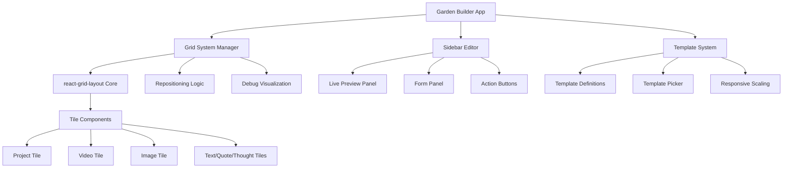

# Design Document: Garden Builder Refactor

## Overview

This design document outlines the technical approach for refactoring the digital garden/portfolio builder from a free-form grid system to a template-based approach with enhanced editing capabilities. The refactor maintains the existing react-grid-layout foundation while introducing predefined templates, intelligent repositioning, and a comprehensive sidebar editor with live preview functionality.

The design emphasizes professional editing experiences similar to modern design tools like Figma or Canva, where users work with structured templates while maintaining creative flexibility through repositioning and content customization.

## Architecture

### High-Level Architecture



### Component Hierarchy

The refactored system maintains the existing component structure while introducing new template and editing components:

- **GardenBuilder** (Root Component)
  - **GridSystemManager** (Enhanced grid management)
    - **TemplateGrid** (Template-constrained grid)
    - **DebugOverlay** (Enhanced debug visualization)
  - **SidebarEditor** (New comprehensive editor)
    - **LivePreviewPanel** (Real-time tile preview)
    - **FormPanel** (Tile-specific editing forms)
    - **ActionButtons** (Save/Delete controls)
  - **TemplateSystem** (New template management)
    - **TemplatePicker** (Visual template selection)
    - **TemplateDefinitions** (Template configurations)

## Components and Interfaces

### Template System

#### Template Definition Interface

```typescript
interface TileTemplate {
  id: string;
  name: string;
  category: 'square' | 'rectangle' | 'circle';
  dimensions: {
    w: number; // Grid units width
    h: number; // Grid units height
  };
  aspectRatio: number;
  allowedTileTypes: TileType[];
  responsiveScaling: ResponsiveConfig;
}

interface ResponsiveConfig {
  breakpoints: {
    mobile: ScalingRule;
    tablet: ScalingRule;
    desktop: ScalingRule;
  };
}

interface ScalingRule {
  minWidth: number;
  maxWidth: number;
  scaleFactor: number;
}
```

#### Predefined Templates

Based on the requirements and chester.how analysis, the system provides these templates:

**Square Templates:**
- Small Square (1x1): Ideal for status updates, small images
- Medium Square (2x2): Perfect for featured content, medium images
- Large Square (3x3): Showcase pieces, large media content

**Rectangle Templates:**
- Small Rectangle (2x1): Text snippets, small project previews
- Medium Rectangle (3x2): Article previews, medium projects
- Wide Rectangle (4x2): Banner content, wide images
- Large Rectangle (6x3): Featured projects, detailed content

**Circle Templates:**
- Small Circle (1x1 container): Profile images, icons
- Medium Circle (2x2 container): Featured images, avatars
- Large Circle (3x3 container): Hero images, main visuals

### Grid System Manager

#### Enhanced Grid Configuration

```typescript
interface GridConfig {
  cols: number;
  rowHeight: number;
  margin: [number, number];
  containerPadding: [number, number];
  isDraggable: boolean;
  isResizable: false; // Always false in new system
  compactType: 'vertical' | 'horizontal' | null;
  preventCollision: boolean;
  useCSSTransforms: boolean;
}

interface RepositioningLogic {
  calculateValidDropZones(draggedItem: GridItem, layout: Layout): DropZone[];
  shiftTilesOnDrop(targetPosition: Position, layout: Layout): Layout;
  validatePlacement(item: GridItem, position: Position, layout: Layout): boolean;
}
```

#### Debug Visualization Enhancement

The enhanced debug mode provides detailed grid information:

```typescript
interface DebugVisualization {
  showRowBorders: boolean;
  showColumnBorders: boolean;
  showDimensions: boolean;
  showGaps: boolean;
  displayMetrics: {
    rowHeights: number[];
    columnWidths: number[];
    gaps: {
      horizontal: number;
      vertical: number;
    };
  };
}
```

### Sidebar Editor System

#### Sidebar Layout Structure

The sidebar editor uses a 75% screen width layout with two main sections:

```typescript
interface SidebarEditor {
  isOpen: boolean;
  width: '75%';
  layout: {
    leftPanel: LivePreviewPanel;
    rightPanel: FormPanel;
    actionBar: ActionButtons;
  };
  currentTile: TileData | null;
  isDirty: boolean;
}

interface LivePreviewPanel {
  position: 'left';
  width: '50%'; // 50% of sidebar width
  alignment: 'center';
  content: TilePreview;
  updateMode: 'realtime';
}

interface FormPanel {
  position: 'right';
  width: '50%'; // 50% of sidebar width
  fields: FormField[];
  validation: ValidationRules;
  tileType: TileType;
}
```

#### Tile-Specific Form Configurations

Each tile type has a customized form configuration:

```typescript
interface TileFormConfig {
  project: {
    fields: ['title', 'description', 'images', 'links', 'technologies', 'category'];
    uploadOptions: ImageUploadConfig;
    showcaseSettings: ProjectShowcaseConfig;
  };
  video: {
    fields: ['title', 'description', 'videoFile', 'thumbnail', 'playbackSettings'];
    uploadOptions: VideoUploadConfig;
    playbackControls: VideoControlsConfig;
  };
  image: {
    fields: ['title', 'alt', 'imageFile', 'caption', 'displaySettings'];
    uploadOptions: ImageUploadConfig;
    displaySettings: ImageDisplayConfig;
  };
  text: {
    fields: ['title', 'content', 'formatting', 'links'];
    richTextEditor: RichTextConfig;
  };
  quote: {
    fields: ['quote', 'author', 'source', 'formatting'];
    richTextEditor: RichTextConfig;
  };
  thought: {
    fields: ['content', 'mood', 'tags', 'formatting'];
    richTextEditor: RichTextConfig;
  };
}
```

## Data Models

### Enhanced Tile Data Structure

The tile data structure is extended to support templates while maintaining backward compatibility:

```typescript
interface TileData {
  // Existing fields (maintained for compatibility)
  id: string;
  type: TileType;
  content: TileContent;
  position: GridPosition;
  
  // New template-related fields
  template: {
    id: string;
    category: TemplateCategory;
    dimensions: TemplateDimensions;
  };
  
  // Enhanced metadata
  metadata: {
    createdAt: Date;
    updatedAt: Date;
    version: string;
    migrationSource?: 'legacy' | 'new';
  };
}

interface GridPosition {
  x: number;
  y: number;
  w: number; // Now determined by template
  h: number; // Now determined by template
  static?: boolean;
  isDraggable: boolean;
  isResizable: false; // Always false
}
```

### Template Mapping for Legacy Data

To ensure backward compatibility, the system includes a migration strategy:

```typescript
interface LegacyMigration {
  mapSizeToTemplate(width: number, height: number, tileType: TileType): TileTemplate;
  preserveContent(legacyTile: LegacyTileData): TileContent;
  validateMigration(originalTile: LegacyTileData, migratedTile: TileData): boolean;
}

// Example mapping rules
const LEGACY_SIZE_MAPPING = {
  '1x1': 'small-square',
  '2x1': 'small-rectangle',
  '2x2': 'medium-square',
  '3x2': 'medium-rectangle',
  // ... additional mappings
};
```

### Responsive Breakpoint Configuration

```typescript
interface ResponsiveBreakpoints {
  mobile: {
    maxWidth: 768;
    cols: 2;
    rowHeight: 120;
    margin: [8, 8];
  };
  tablet: {
    maxWidth: 1024;
    cols: 4;
    rowHeight: 150;
    margin: [12, 12];
  };
  desktop: {
    minWidth: 1025;
    cols: 6;
    rowHeight: 180;
    margin: [16, 16];
  };
}
```

## Correctness Properties

*A property is a characteristic or behavior that should hold true across all valid executions of a system—essentially, a formal statement about what the system should do. Properties serve as the bridge between human-readable specifications and machine-verifiable correctness guarantees.*

### Property 1: Template Category Completeness
*For any* template system query, the returned template categories should be exactly rectangle, square, and circle with no additional or missing categories.
**Validates: Requirements 1.1**

### Property 2: Template Dimensions Consistency
*For any* template category, square templates should have dimensions 1x1, 2x2, 3x3 and rectangle templates should have dimensions 2x1, 3x2, 4x2, 6x3 grid units.
**Validates: Requirements 1.3, 1.4**

### Property 3: Tile Type Template Restrictions
*For any* video or image tile type, the available templates should only include circle templates, while other tile types should have access to multiple template categories.
**Validates: Requirements 1.5**

### Property 4: Template Aspect Ratio Preservation
*For any* template and responsive breakpoint combination, the aspect ratio should remain constant across all screen sizes.
**Validates: Requirements 1.6**

### Property 5: Resize Prevention
*For any* tile in the grid system, attempting to resize should be prevented and the tile dimensions should remain unchanged.
**Validates: Requirements 2.1, 2.2**

### Property 6: Intelligent Repositioning
*For any* tile repositioning operation, other tiles should shift to accommodate the move without creating overlaps or invalid positions.
**Validates: Requirements 2.3**

### Property 7: Live Preview Synchronization
*For any* tile property modification in the sidebar editor, the live preview should update to reflect the changes immediately.
**Validates: Requirements 3.4**

### Property 8: Tile-Specific Form Fields
*For any* tile type, the sidebar editor should display the appropriate form fields specific to that tile type (upload options for project/video/image tiles, rich text for text/quote/thought tiles, and common fields for all types).
**Validates: Requirements 4.1, 4.2, 4.3, 4.4, 4.5**

### Property 9: Form Validation Error Handling
*For any* invalid input data in the sidebar editor, the form system should display appropriate error messages and prevent submission.
**Validates: Requirements 4.6**

### Property 10: Responsive Template Scaling
*For any* screen size change, templates should scale proportionally while maintaining their defined aspect ratios and grid relationships.
**Validates: Requirements 5.1, 5.2**

### Property 11: Circle Template Shape Preservation
*For any* circle template at any screen size, the template should maintain its circular appearance through proper CSS properties.
**Validates: Requirements 5.5**

### Property 12: Visual Feedback During Interactions
*For any* repositioning operation, the grid system should provide clear visual feedback showing valid drop zones and hover states.
**Validates: Requirements 6.1, 6.3**

### Property 13: Smooth Animation Consistency
*For any* tile movement, template change, sidebar operation, or property update, the system should display smooth animations and transitions.
**Validates: Requirements 6.2, 6.4, 6.5**

### Property 14: Legacy Data Migration
*For any* existing portfolio data, the system should correctly map legacy tile sizes to appropriate templates while preserving all content and metadata.
**Validates: Requirements 7.2, 7.3, 7.4**

### Property 15: Template Data Persistence
*For any* portfolio save operation, the system should store both legacy data structures and new template information for backward compatibility.
**Validates: Requirements 7.5**

### Property 16: Template Picker Functionality
*For any* tile creation or template selection operation, the template picker should display appropriate thumbnails, highlight selections, group by category, and filter based on tile type restrictions.
**Validates: Requirements 8.2, 8.3, 8.4, 8.5, 8.6**

### Property 17: Comprehensive Debug Visualization
*For any* debug mode activation, the system should display gap markers, size indicators, row borders, grid boundaries, spacing measurements, and visual distinction between content and structure.
**Validates: Requirements 9.1, 9.2, 9.3, 9.4, 9.5**

## Error Handling

### Template System Error Handling

The template system must gracefully handle various error conditions:

1. **Invalid Template Selection**: When a user attempts to select an incompatible template for a tile type, the system should prevent the selection and display a clear error message explaining the restriction.

2. **Template Loading Failures**: If template definitions fail to load, the system should fall back to a minimal set of default templates and notify the user of the degraded functionality.

3. **Responsive Scaling Errors**: When responsive calculations fail, the system should maintain the last known good scaling values and log the error for debugging.

### Grid System Error Handling

1. **Collision Detection**: When repositioning would cause tile overlaps, the system should prevent the move and highlight the conflicting area.

2. **Invalid Positions**: If a tile is moved to an invalid grid position, the system should snap it to the nearest valid position.

3. **Layout Corruption**: If the grid layout becomes corrupted, the system should attempt automatic recovery and provide a manual reset option.

### Sidebar Editor Error Handling

1. **Form Validation**: Invalid form inputs should be highlighted with specific error messages and prevent saving until resolved.

2. **Preview Rendering Errors**: If the live preview fails to render, the system should display a placeholder and error message while maintaining form functionality.

3. **Save/Delete Failures**: Network or storage errors during save/delete operations should be clearly communicated with retry options.

### Data Migration Error Handling

1. **Legacy Data Incompatibility**: If legacy data cannot be migrated, the system should preserve the original data and flag it for manual review.

2. **Template Mapping Failures**: When legacy sizes don't map to available templates, the system should select the closest match and log the approximation.

## Testing Strategy

### Dual Testing Approach

The garden builder refactor requires both unit testing and property-based testing to ensure comprehensive coverage:

**Unit Tests** focus on:
- Specific template configurations and edge cases
- Individual component behavior and integration points
- Error conditions and boundary cases
- User interface interactions and state management
- Legacy data migration scenarios

**Property Tests** focus on:
- Universal properties that hold across all template combinations
- Responsive behavior across different screen sizes
- Grid repositioning logic with randomized layouts
- Form validation with generated input data
- Template system consistency across all tile types

### Property-Based Testing Configuration

The testing strategy uses **React Testing Library** with **fast-check** for property-based testing in TypeScript/React applications. Each property test runs a minimum of 100 iterations to ensure comprehensive input coverage.

**Test Configuration Requirements:**
- Minimum 100 iterations per property test
- Each property test references its design document property
- Tag format: **Feature: garden-builder-refactor, Property {number}: {property_text}**
- Randomized test data generation for tiles, templates, and grid layouts
- Responsive breakpoint simulation for scaling tests

**Example Property Test Structure:**
```typescript
// Feature: garden-builder-refactor, Property 1: Template Category Completeness
fc.assert(fc.property(
  fc.constantFrom('square', 'rectangle', 'circle', 'invalid'),
  (category) => {
    const templates = templateSystem.getTemplatesByCategory(category);
    if (['square', 'rectangle', 'circle'].includes(category)) {
      expect(templates.length).toBeGreaterThan(0);
    } else {
      expect(templates.length).toBe(0);
    }
  }
), { numRuns: 100 });
```

### Integration Testing

Integration tests verify the interaction between major system components:
- Template system integration with grid layout
- Sidebar editor communication with grid state
- Responsive system coordination across components
- Data persistence and migration workflows

### Performance Testing

While not part of the core correctness properties, performance tests ensure the refactored system maintains acceptable performance:
- Grid rendering performance with large numbers of tiles
- Sidebar editor responsiveness during real-time updates
- Template scaling performance across breakpoints
- Memory usage during extended editing sessions